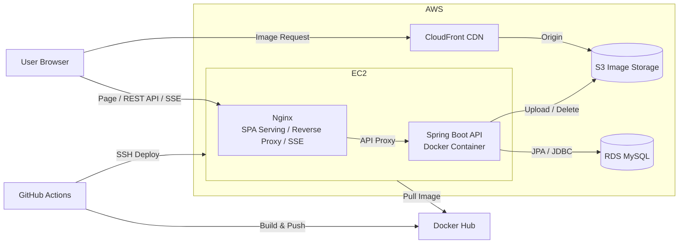
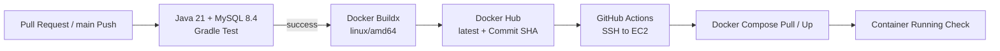

# 코드 한입

## Back-end 소개

**코드 한입**은 개발자들이 오늘 개발하며 겪은 경험, 문제 해결 과정, 고민과 생각을 부담 없이 기록하고 나누는 가벼운 개발자 커뮤니티입니다.

Spring Boot와 MySQL을 기반으로 회원 인증, 게시글·댓글·답글, 좋아요, 다중 이미지, 임시저장, 신고 및 실시간 알림 API를 구현했습니다. 단순 CRUD에 그치지 않고 JWT 재발급 전략, 트랜잭션 커밋 후 비동기 SSE 알림, S3·CloudFront 이미지 관리, 부하 테스트를 통한 폴링과 SSE의 비용 구조 비교까지 직접 설계하고 검증했습니다.

## 개발 인원 및 기간

- 개발 기간: 2026-05-26 ~ 2026-08-09
- 개발 인원: 프론트엔드 / 백엔드 1명 (본인)
- 담당 범위: 도메인·DB 모델링, REST API, 인증·인가, SSE 알림, 이미지 저장소, 테스트, 부하 테스트, 인프라와 CI/CD 구성

## 핵심 구현

- Access·Refresh Token 분리, Refresh Token Rotation·해시 저장·기기별 세션 폐기를 적용한 JWT 인증
- 좋아요·댓글·답글 트랜잭션 커밋 후 전용 Executor에서 전송하는 SSE 실시간 알림
- 사용자·브라우저 탭별 `SseEmitter` 관리, heartbeat, timeout·오류·종료 콜백 정리
- 커서 기반 페이지네이션을 적용한 게시글·알림 목록 API
- S3 이미지 저장과 CloudFront URL 제공, DB 참조와 유예 기간을 기준으로 한 고아 이미지 정리
- 5초 Polling과 SSE 연결 유지를 k6·Actuator로 비교해 CPU, Heap, 스레드, DB 커넥션과 안정 사용자 구간 분석
- GitHub Actions에서 MySQL 통합 테스트, Docker 이미지 빌드·푸시, EC2 배포 자동화

## 사용 기술 및 Tools

| 구분 | 기술 및 도구 | 활용 |
| --- | --- | --- |
| Language | Java 21 | 백엔드 애플리케이션 개발 |
| Framework | Spring Boot 3.5, Spring MVC | REST API와 SSE 서버 구현 |
| Security | Spring Security, JJWT | JWT 인증·인가와 역할 기반 접근 제어 |
| Database | MySQL 8.4, Spring Data JPA, Hibernate | 도메인 영속성과 트랜잭션 관리 |
| Storage / CDN | AWS S3, CloudFront, AWS SDK for Java | 이미지 저장과 CDN URL 제공 |
| Monitoring | Spring Boot Actuator | JVM, Tomcat, HikariCP와 커스텀 SSE 지표 수집 |
| Test | JUnit 5, Spring Boot Test, Mockito, JaCoCo | 도메인·서비스·컨트롤러 테스트 |
| Load Test | k6, xk6-sse | Polling 요청 한계와 SSE 연결 유지 성능 검증 |
| Build | Gradle | 의존성, 테스트와 빌드 관리 |
| Container | Docker, Docker Compose | 애플리케이션 이미지와 통합 실행 환경 구성 |
| CI/CD | GitHub Actions, Docker Hub | 테스트, 이미지 푸시와 EC2 자동 배포 |
| Infrastructure | AWS EC2, RDS, S3, CloudFront, Nginx | 애플리케이션·DB·이미지 운영 환경 구성 |
| Collaboration | Git, GitHub | 버전 및 소스 코드 관리 |

## Front-end

- Front-end GitHub: [100-hours-a-week/KTB4_Theo_FE](https://github.com/100-hours-a-week/KTB4_Theo_FE)

## 서비스 시연 영상

<!-- 시연 영상을 업로드한 후 Google Drive 공유 주소를 추가해 주세요. -->

- Google Drive: 

## 폴더 구조

<details>
<summary>폴더 구조 보기 / 숨기기</summary>

```text
├── .github
│   └── workflows
│       └── ci-cd.yml
├── load-tests
│   ├── data
│   ├── k6
│   ├── monitoring
│   ├── reports
│   └── token
├── src
│   ├── main
│   │   ├── java/com/theo/community_api
│   │   │   ├── auth
│   │   │   ├── comment
│   │   │   ├── common
│   │   │   ├── draft
│   │   │   ├── image
│   │   │   ├── notification
│   │   │   ├── post
│   │   │   ├── reply
│   │   │   ├── user
│   │   │   └── CommunityApiApplication.java
│   │   └── resources
│   │       ├── application.yaml
│   │       ├── application-local.yaml
│   │       └── application-prod.yaml
│   └── test
│       ├── java/com/theo/community_api
│       └── resources/application-test.yaml
├── Dockerfile
├── build.gradle
├── gradlew
├── settings.gradle
└── README.md
```

</details>

### 서버 구조

소스 코드는 사용자·게시글·알림 등 업무 도메인을 기준으로 분리했습니다. 각 도메인은 필요에 따라 `controller`, `service`, `repository`, `domain`, `dto`를 가지며, 인증·SSE·이미지처럼 복잡도가 높은 기능은 세부 책임별 패키지로 추가 분리했습니다.

```text
community_api
├── common          # 공통 응답, 예외, 보안·S3 설정, UTC 시간 처리
├── auth            # JWT 발급·재발급, Refresh Token, Security 필터
├── user            # 회원가입, 회원 정보, 프로필·비밀번호, 회원 탈퇴
├── post            # 게시글, 좋아요, 조회 이력, 이미지, 수정 이력, 신고·제재
├── comment         # 댓글 작성·수정·삭제
├── reply           # 답글 작성·수정·삭제
├── draft           # 게시글 임시저장·발행과 임시 이미지
├── notification    # 알림 영속성, 목록·읽음, SSE 연결·지표·heartbeat
└── image           # 이미지 검증, S3 저장, CloudFront URL, 고아 이미지 정리
```

## 시스템 아키텍처

### 인프라 구조



## 주요 기능

### User & Auth

- Spring Security와 JWT 필터를 통한 Stateless Access Token 인증
- Access Token은 응답 본문, Refresh Token은 HttpOnly Cookie로 분리 전달
- Refresh Token 원문 대신 SHA-256 해시를 DB에 저장하고 재발급 시 Rotation 적용
- 동일 기기의 재로그인 시 현재 Refresh Token만 폐기하고, 회원 탈퇴 시 해당 사용자의 전체 Token 폐기
- 로그인·로그아웃, 회원가입, 프로필·비밀번호 변경, 소프트 탈퇴 구현

### Post

- `lastPostId` 커서와 조회 개수를 사용한 게시글 목록 응답
- JSON 요청과 다중 이미지를 하나의 `multipart/form-data` 요청으로 처리
- 게시글 수정 시 유지할 이미지와 신규 이미지를 구분하고 이미지 순서 유지
- 사용자별 좋아요·조회 이력을 별도 엔티티로 관리하고 DB 유니크 제약으로 중복 방지
- 게시글 임시저장·수정·삭제·발행과 임시 이미지 관리
- 작성자 권한 검증, 게시글 소프트 삭제, 트랜잭션 커밋 후 연관 이미지 정리

### Comment & Reply

- 게시글 하위 리소스로 댓글·답글 REST API 구성
- 작성자만 수정·삭제할 수 있도록 소유권 검증
- 댓글·답글 작성 시 게시글 작성자와 상위 댓글 작성자에게 알림 생성
- 자기 자신의 행동은 알림 대상에서 제외해 불필요한 알림 방지

### Notification

- 알림을 DB에 먼저 저장한 뒤 트랜잭션 `AFTER_COMMIT`에서 SSE로 전송해 정합성 보장
- SSE 전송은 전용 Executor에서 비동기 실행해 핵심 도메인 트랜잭션과 분리
- 사용자와 탭별 UUID를 조합해 여러 탭의 SSE 연결을 동시 관리
- 연결 완료·타임아웃·오류 콜백과 heartbeat 전송으로 종료된 Emitter 정리
- `lastNotificationId` 커서 기반 목록, 미읽 개수, 개별·전체 읽음 API 제공
- 활성 연결, 연결·전송·heartbeat 성공·실패를 Actuator 커스텀 지표로 수집

### Image

- 이미지 확장자·MIME Type·파일 크기를 검증하고 카테고리별 S3 Key 생성
- `ImageStorage`로 저장소 책임을 추상화하고 S3 구현체와 도메인 서비스 분리
- DB에는 S3 Key를 저장하고 API 응답 시 CloudFront URL로 변환
- 업로드 후 DB 트랜잭션이 롤백되면 신규 S3 객체를 삭제하고, 기존 이미지는 DB 커밋 후 삭제
- S3 객체와 DB 참조 Key를 비교해 유예 기간이 지난 고아 이미지만 정리
- 실제 삭제 전 dry-run으로 후보를 확인할 수 있게 구성

### Report & Moderation

> 독립된 관리자 시스템이 아닌, 게시글 운영을 위한 신고·제재 기능입니다.

- 일반 사용자의 게시글 신고와 중복 신고 방지
- `ADMIN` 역할만 신고 목록을 조회하고 승인·반려하도록 접근 제어
- 승인된 신고가 5건 이상 누적되면 게시글을 블라인드 처리
- 게시글 수정 전 제목·본문을 `post_revision`에 보존해 이력 추적

## 주요 기술적 개선

### 1. 반복 Polling에서 SSE 실시간 알림으로 전환

5초 Polling은 새 알림이 없어도 모든 활성 사용자가 반복적으로 HTTP 요청과 DB 조회를 발생시켰습니다. 부하 테스트로 폴링 주기를 30초에서 5초로 줄이면 요청량이 6배 증가함을 확인했고, 이를 새 이벤트가 있을 때만 서버가 전송하는 SSE로 전환했습니다.

### 2. 알림 영속성과 실시간 전송의 트랜잭션 분리

알림 엔티티 저장과 SSE 전송을 동일 트랜잭션에서 바로 처리하면, 롤백된 알림이 클라이언트에 먼저 전송될 수 있고 네트워크 I/O가 핵심 트랜잭션을 지연시킬 수 있습니다. `@TransactionalEventListener(AFTER_COMMIT)`과 전용 Executor를 사용해 DB 커밋 완료 후에만 비동기 전송하도록 분리했습니다.

### 3. Refresh Token 원문 보관과 재사용 범위 축소

Refresh Token을 DB에 원문으로 보관하지 않고 SHA-256 해시로 저장했습니다. 재발급 시 기존 Token을 삭제하고 Access·Refresh Token을 모두 교체해 이미 사용된 Token의 재사용 범위를 줄였습니다. 로그아웃은 현재 기기 Token만, 회원 탈퇴는 전체 Token을 폐기하도록 범위를 구분했습니다.

### 4. 파일 저장소와 도메인 로직 분리

업로드 로직이 AWS SDK에 직접 의존하지 않도록 `ImageStorage`로 추상화했습니다. DB에는 배포 환경의 URL이 아닌 저장소 Key를 보관하고, API 응답 시 `ImageUrlResolver`를 통해 CloudFront URL로 변환하도록 분리했습니다.

### 5. 업로드되었지만 참조되지 않는 이미지 정리

S3 업로드와 DB 트랜잭션은 하나의 ACID 트랜잭션으로 묶을 수 없어 중간 실패 시 고아 파일이 남을 수 있습니다. S3 객체와 현재 DB가 참조하는 Key를 비교하고, 유예 기간이 지난 비참조 객체만 삭제 후보로 선정했습니다. dry-run을 기본으로 두어 운영 오삭제 위험을 줄였습니다.

## 성능 테스트

> 절대적인 운영 수용량이 아니라 k6, Spring Boot와 MySQL을 동일 로컬 장비에서 실행해 확인한 비교 결과입니다.

### Polling 부하 테스트

- 대상: `GET /notifications/unread-count`
- 기준: 성공률 99% 이상, p95 500ms 미만, p99 1초 미만
- 사용자별 고유 JWT를 사전 발급해 로그인 비용을 제외하고 Polling 요청만 측정

| 동시 사용자 | 주기 | 실제 RPS | 성공률 | p95 | p99 | 판정 |
| ---: | ---: | ---: | ---: | ---: | ---: | --- |
| 5,000명 | 5초 | 1,000 | 100% | 6.09ms | 217.71ms | 모든 기준 충족 |
| 6,250명 | 5초 | 약 1,250 | 100% | 524.79ms | 884.45ms | p95 기준 첫 초과 |
| 7,500명 | 5초 | 1,500 | 100% | 1.58s | 2.44s | 명확한 체감 지연 |
| 10,000명 | 5초 | 약 1,165 | 84.96% | 9.04s | 10.39s | 처리량 정체·실패 |

5,000명의 약 1,000 RPS까지는 안정적으로 처리했지만, 6,250명부터 HikariCP 포화와 대기 요청으로 p95 기준을 초과했습니다. 10,000명에서는 CPU보다 DB 커넥션과 Tomcat 요청 처리 스레드가 먼저 병목이 됐습니다.

상세 결과: [Polling 부하 테스트 보고서](load-tests/reports/polling-load-test.md)

### SSE 연결 부하 테스트

기존 Polling과 공정하게 비교하기 위해 **대규모 알림 전송은 제외**하고 연결 수립·유지 비용만 측정했습니다.

- Ramp-up 60초, Steady State 120초, Ramp-down 30초
- VU별 고유 JWT로 `GET /notifications/subscribe` 연결
- CPU, Heap, 라이브 스레드, GC, HikariCP, 활성 Emitter 측정

| 목표 사용자 | 최대 활성 연결 | 도달률 | 연결 실패 | 결과 |
| ---: | ---: | ---: | ---: | --- |
| 500명 | 500 | 100% | 0 | 안정 유지 |
| 2,000명 | 2,000 | 100% | 0 | 안정 유지 |
| 5,000명 | 5,000 | 100% | 0 | 안정 유지 |
| 10,000명 | 8,192 | 81.92% | 25,032회¹ | Tomcat 기본 연결 상한 도달 |

¹ 고유 사용자 수가 아니라 실패 후 재시도를 포함한 연결 시도 횟수입니다.

5,000명 비교에서 Polling은 약 1,000 RPS, CPU 약 9.21%, Hikari active/pending 최대 10/188을 사용했습니다. SSE는 반복 요청 없이 CPU 약 0.08%, Hikari active/pending 1/0을 유지했지만 Heap은 약 682.4MiB로 Polling의 약 260.8MiB보다 높았습니다. 즉, CPU·DB·스레드 비용을 장기 연결·Emitter·Heap 비용으로 전환한 결과입니다.

상세 결과: [SSE 연결 부하 테스트 보고서](load-tests/reports/sse-connection-load-test.md)

## API 구조

| 도메인 | Base Path | 주요 API |
| --- | --- | --- |
| Auth | `/auth` | 로그인, Token 재발급, 로그아웃 |
| User | `/users` | 회원가입, 내 정보, 프로필·비밀번호 변경, 회원 탈퇴 |
| Post | `/posts` | 게시글 CRUD, 목록, 상세, 좋아요, 신고 |
| Draft | `/posts/draft` | 임시저장 CRUD, 목록, 발행 |
| Comment | `/posts/{postId}/comments` | 댓글 작성·수정·삭제 |
| Reply | `/posts/{postId}/comments/{commentId}/replies` | 답글 작성·수정·삭제 |
| Notification | `/notifications` | 목록, 미읽 개수, 읽음, SSE 구독 |
| Moderation | `/admin/post-reports` | 신고 목록, 승인, 반려 |

## 데이터베이스 설계

### 요구사항 분석

- 사용자는 여러 기기에서 로그인할 수 있으며, 기기별 Refresh Token 세션을 독립적으로 폐기할 수 있어야 한다.
- 게시글은 여러 이미지, 댓글, 좋아요·조회 이력과 신고·수정 이력을 가진다.
- 사용자와 게시글 간 좋아요·조회·신고는 중복 데이터를 제약해야 한다.
- 댓글은 게시글과 작성자를, 답글은 상위 댓글과 작성자를 참조한다.
- 알림은 수신자·발신자·게시글과 이벤트 원본(댓글·답글 등)을 참조하고 읽음 상태를 관리한다.
- 임시저장과 정식 게시글의 이미지는 서로 다른 생명주기를 가진다.

### 모델링

<!-- ERD 이미지를 docs/images/erd.png에 추가한 후 아래 주석을 해제해 주세요. -->


<!-- <p align="center"></p> -->

| 주요 테이블 | 책임 |
| --- | --- |
| `users` | 회원 정보, 역할, 탈퇴 상태 |
| `refresh_tokens` | 사용자별 해시된 Refresh Token과 만료 시각 |
| `posts`, `post_image` | 게시글과 순서가 있는 다중 이미지 |
| `comments`, `replies` | 게시글 댓글과 댓글 하위 답글 |
| `post_like`, `post_view` | 사용자별 좋아요·조회 이력 |
| `post_report`, `post_revision` | 게시글 신고 처리와 제재 시점 수정 이력 |
| `draft`, `draft_image` | 사용자별 임시저장과 이미지 |
| `notifications` | 알림 수신·발신자, 유형, 원본, 읽음 상태 |

## CI/CD 및 배포



- Pull Request와 `main` Push에서 MySQL 8.4 Service Container를 실행하고 Gradle 테스트 수행
- 테스트 통과 후 `linux/amd64` Docker 이미지를 빌드하고 `latest`와 Commit SHA 태그로 Docker Hub에 푸시
- SSH로 EC2에 접속해 Backend Container만 새 이미지로 교체
- 배포 후 Container 실행 상태를 확인하고 실패 시 최근 로그 출력
